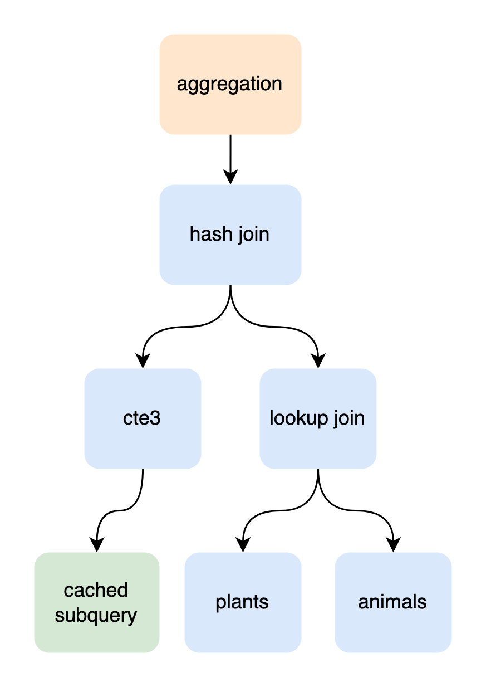
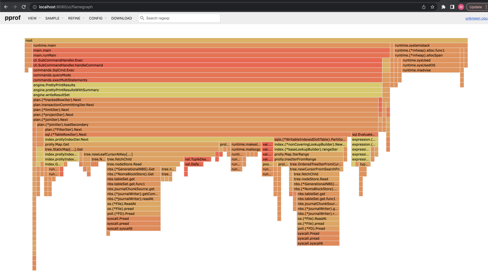
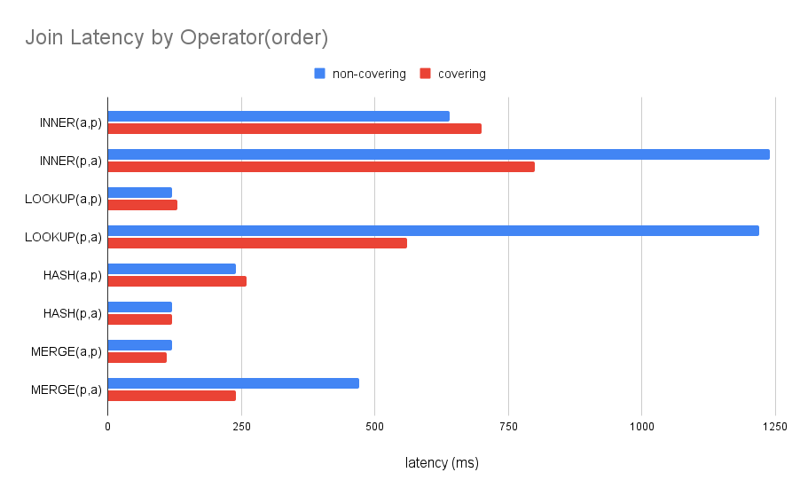
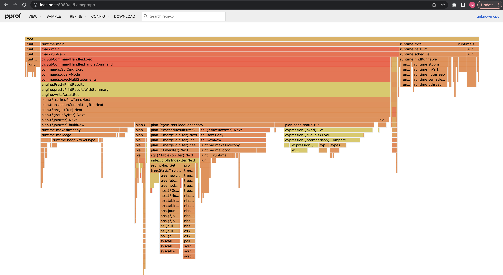

# Debugging slow queries

This blog walks through debugging a slow query. We start by decomposing
a query into its constituent parts. Then we simplify the
query runtime to iterate more quickly. Finally we use EXPLAIN queries, runtime
profiles, and hints to inspect and optimize query performance. 

# Simplifying queries

## Remove noisy operators

Suppose we have a query that is running slowly:

```sql
With cte1 as (
    Select category, elevation, count(*) as cnt
    from animals
    Group by category, elevation
), cte2 as (
    Select category, elevation, count(*) as cnt
    from plants p Group by category, elevation
), cte3 as (
    select *
    from cte1
    join cte2 on cte1.cnt = cte2.cnt
    where cte1.category = 7
)
select count(a.name)
from animals a
join plants p
     on a.category = p. category
join cte3 on
    a.elevation = cte3.elevation and
    a.category = cte3.category
where a.category = 7;
+---------------+
| count(a.name) |
+---------------+
| 10000000      |
+---------------+
________________________________________________________
Executed in   23.15 secs   fish           external
   usr time   23.51 secs  363.00 micros   23.51 secs
   sys time    0.21 secs  1202.00 micros    0.21 secs
```

The query includes of 4 scopes:

1) `cte1`: aggregation on `animals`
2) `cte2`: aggregation on `plants`
3) `cte3`: join between `cte1` and `cte2`
4) Join between: `animals` x `cte3` x `plants`.

Let's start with the CTEs, see how the latency and row counts they contribute:

```sql
-- cte1
select count(*) from (
    select category, elevation, count(*) as cnt
    from animals group by category, elevation
) s;
+----------+
| count(*) |
+----------+
| 4003     |
+----------+
________________________________________________________
Executed in  257.79 millis    fish           external
   usr time  226.65 millis  114.00 micros  226.53 millis
   sys time   41.67 millis  572.00 micros   41.10 millis

-- cte2
select count(*) from (
    select category, elevation, count(*) as cnt
    from plants p group by category, elevation                    
) s;
+----------+
| count(*) |
+----------+
| 4003     |
+----------+
________________________________________________________
Executed in  394.93 millis    fish           external
   usr time  262.36 millis  119.00 micros  262.25 millis
   sys time   71.74 millis  620.00 micros   71.12 millis

-- cte3
with cte1 as (
  Select category, elevation, count(*) as cnt
  from animals
  Group by category, elevation
), cte2 as (
  select category, elevation, count(*) as cnt
  from plants p group by category, elevation
)
select count(*) from
    (
    select *
    from cte1
    join cte2 on cte1.cnt = cte2.cnt
    where cte1.elevation = 0 and
          cte2.elevation = 1
) s;
+----------+
| count(*) |
+----------+
| 400      |
+----------+
________________________________________________________
Executed in  224.48 millis    fish           external
   usr time  109.22 millis  140.00 micros  109.08 millis
   sys time   55.12 millis  660.00 micros   54.46 millis
```

(We wrap every query in this deep dive with a `select count(*) from (...) s` 1)
to avoid long output result sets, and 2) because it quickly summarizes the
number of output rows for a scope.)

No CTE stands out as particularly expensive. We can take a look at the base
tables next:

```sql
-- animals
select count(*) from animals;
+----------+
| count(*) |
+----------+
| 200003   |
+----------+
________________________________________________________
Executed in  433.95 millis    fish           external
   usr time  111.08 millis  121.00 micros  110.96 millis
   sys time   75.68 millis  612.00 micros   75.07 millis

-- plants
select count(*) from plants;
+----------+
| count(*) |
+----------+
| 200003   |
+----------+
________________________________________________________
Executed in  234.20 millis    fish           external
   usr time  117.26 millis  136.00 micros  117.12 millis
   sys time   58.89 millis  687.00 micros   58.21 millis
```

The `plants` and `animals` tables are definitely bigger than the CTEs.
We could test the `[cte3 x plants]` and `[cte3 x animals]` joins, but in
this case the `[200_000 x 200_000]` join is more expensive than
`[200,000 x 400]`:

```sql
-- [plants x animals]
select count(*) from (
    select p.category, p.name, a.name
    from animals a join plants p
    on a.category = p. category
    where a.category = 7
) s;
+----------+
| count(*) |
+----------+
| 2500     |
+----------+
________________________________________________________
Executed in   18.81 secs   fish           external
   usr time   18.55 secs   85.23 millis   18.47 secs
   sys time    0.19 secs   24.21 millis    0.17 secs
```

The cardinality (number of output rows) is not particularly high, but just
joining these two tables took almost 20 seconds. We have a potential culprit!

## Abbreviate runtime

When possible, we prefer debugging abbreviated versions of expensive
long-running queries. We will run the query dozens or hundreds of times
while experimenting, and faster feedback will be more better.

Our ideal abbreviated query should take about a second. If we make the query too
short, the overhead of printing results dominates the runtime (see profiles
below for how to quantify overhead).

When we are lucky, a `LIMIT` clause will short-circuit a query after a specified
number of rows are returned:

```sql
select count(*) from (
    select p.category, p.name, a.name
    from animals a join plants p
    on a.category = p. category
    where a.category = 7
    limit 10
) s;
+----------+
| count(*) |
+----------+
| 200      |
+----------+
________________________________________________________
Executed in    1.56 secs   fish           external
   usr time  1294.20 millis  137.00 micros  1294.06 millis
   sys time   75.01 millis  657.00 micros   74.35 millis
```

The limit reduces the cardinality of the whole join, exiting when we've
matched 200 rows. This works when the join returns many rows that are
opportunities to exit early.

Joins that returns few or no rows are more complicated because they expose
no hooks for a `LIMIT` to exit early. In that case, we need to reduce the
cardinality of the join inputs (join leafs return fewer rows).

First, we can `LIMIT` the cardinality of subscopes:

```sql
select count(*) from (
select p.category, p.name, a.name
from animals a join (select * from plants limit 200) p
on a.category = p. category
where a.category = 7
) s;
```

Unfortunately, the addition of a subquery alters the execution plan; `plants` is
no longer available for `LOOKUP_JOIN` or `MERGE_JOIN` optimizations (more in
later sections).

Adding filters is the second way to abbreviate a table's
cardinality (number of output rows). Below we addi a filter to `plants`
that will make the join `[2500 x 200_000]` rather than `[200_000 x 200_000]`
(you could also argue that the after is `[2500 x 2500]`, depending on the
join strategy.)

```sql
select count(*) from (
    select p.category, p.name, a.name
    from animals a join plants p
    on a.category = p. category
    where a.category = 7 and
          p.category = 7
) s;
+----------+
| count(*) |
+----------+
| 2500     |
+----------+
________________________________________________________
Executed in    1.62 secs   fish           external
   usr time  895.93 millis  188.00 micros  895.75 millis
   sys time  131.42 millis  848.00 micros  130.58 millis
```

# Tools For Debugging

## Explain output

We hinted that isolated subqueries often executed differently outside
their original contexts. This is because the optimizer makes macro-optimizations
across subqueries and relational boundaries.

There are ways to observe how different queries are executed and also ways
to correct for differences.

The `EXPLAIN` query output peeks into a query's execution plan, providing our
bread and butter feedback of how changes to a query string
translate into the execution plan.

Going back to the original query:

```text
+-------------------------------------------------------------------------------------------------------------+
| plan                                                                                                        |
+-------------------------------------------------------------------------------------------------------------+
| GroupBy                                                                                                     |
|  ├─ SelectedExprs(COUNT(a.name))                                                                            |
|  ├─ Grouping()                                                                                              |
|  └─ HashJoin                                                                                                |
|      ├─ ((a.elevation = cte3.elevation) AND (a.category = cte3.category))                                   |
|      ├─ SubqueryAlias                                                                                       |
|      │   ├─ name: cte3                                                                                      |
|      │   ├─ outerVisibility: false                                                                          |
|      │   ├─ cacheable: true                                                                                 |
|      │   └─ Project                                                                                         |
|      │       ├─ columns: [cte1.category, cte1.elevation, cte1.cnt, cte2.category, cte2.elevation, cte2.cnt] |
|      │       └─ HashJoin                                                                                    |
|      │           ├─ (cte1.cnt = cte2.cnt)                                                                   |
|      │           ├─ SubqueryAlias                                                                           |
|      │           │   ├─ name: cte2                                                                          |
|      │           │   ├─ outerVisibility: false                                                              |
|      │           │   ├─ cacheable: true                                                                     |
|      │           │   └─ Project                                                                             |
|      │           │       ├─ columns: [p.category, p.elevation, COUNT(1) as cnt]                             |
|      │           │       └─ GroupBy                                                                         |
|      │           │           ├─ SelectedExprs(p.category, p.elevation, COUNT(1))                            |
|      │           │           ├─ Grouping(p.category, p.elevation)                                           |
|      │           │           └─ TableAlias(p)                                                               |
|      │           │               └─ Table                                                                   |
|      │           │                   ├─ name: plants                                                        |
|      │           │                   └─ columns: [category elevation]                                       |
|      │           └─ HashLookup                                                                              |
|      │               ├─ outer: (cte2.cnt)                                                                   |
|      │               ├─ inner: (cte1.cnt)                                                                   |
|      │               └─ CachedResults                                                                       |
|      │                   └─ SubqueryAlias                                                                   |
|      │                       ├─ name: cte1                                                                  |
|      │                       ├─ outerVisibility: false                                                      |
|      │                       ├─ cacheable: true                                                             |
|      │                       └─ Project                                                                     |
|      │                           ├─ columns: [animals.category, animals.elevation, COUNT(1) as cnt]         |
|      │                           └─ GroupBy                                                                 |
|      │                               ├─ SelectedExprs(animals.category, animals.elevation, COUNT(1))        |
|      │                               ├─ Grouping(animals.category, animals.elevation)                       |
|      │                               └─ IndexedTableAccess(animals)                                         |
|      │                                   ├─ index: [animals.category]                                       |
|      │                                   ├─ filters: [{[7, 7]}]                                             |
|      │                                   └─ columns: [category elevation]                                   |
|      └─ HashLookup                                                                                          |
|          ├─ outer: (cte3.elevation, cte3.category)                                                          |
|          ├─ inner: (a.elevation, a.category)                                                                |
|          └─ CachedResults                                                                                   |
|              └─ LookupJoin                                                                                  |
|                  ├─ (a.category = p.category)                                                               |
|                  ├─ TableAlias(p)                                                                           |
|                  │   └─ Table                                                                               |
|                  │       ├─ name: plants                                                                    |
|                  │       └─ columns: [category]                                                             |
|                  └─ Filter                                                                                  |
|                      ├─ (a.category = 7)                                                                    |
|                      └─ TableAlias(a)                                                                       |
|                          └─ IndexedTableAccess(animals)                                                     |
|                              ├─ index: [animals.category]                                                   |
|                              └─ columns: [name category elevation]                                          |
+-------------------------------------------------------------------------------------------------------------+
```

There is a lot of output here, can break it down step by step. Refer to the
diagram below for a visualization of the join tree (in blue).



The entry  level scope is an aggregation projecting `COUNT(a.name)`. The main
input into that aggregation is a three-way join between `cte3`, `plants`, and
`animals`.

The `[plants x animals]` LOOKUP_JOIN constructs a `(category)` key for
every `plant` row to index into `animals.category`.
The `cte3 x [plants x animals]` HASH_JOIN places each row returned by
`[plants x animals]` into an in-memory hash map keyed by `animals.category`.
The first row from `cte3` scans all rows from the join-right, but every two+
row from `cte3` probes the hash map for matches.

`cte3` is a subquery and has its own internal join that takes up a lot of space
in the plan output. But we have identified that `cte3` executes quickly.
And we can see here that `cte3` is cached and will therefore only execute
once. Therefore we can discard `cte3` when looking at plans, for now.

Now let's look at the simplified query that filters `cte3`:

```sql
explain
select p.category, p.name, a.name
from animals a join plants p
on a.category = p. category
where a.category = 7

+-----------------------------------------------+
| plan                                          |
+-----------------------------------------------+
| Project                                       |
|  ├─ columns: [p.category, p.name, a.name]     |
|  └─ LookupJoin                                |
|      ├─ (a.category = p.category)             |
|      ├─ TableAlias(p)                         |
|      │   └─ Table                             |
|      │       ├─ name: plants                  |
|      │       └─ columns: [name category]      |
|      └─ Filter                                |
|          ├─ (a.category = 7)                  |
|          └─ TableAlias(a)                     |
|              └─ IndexedTableAccess(animals)   |
|                  ├─ index: [animals.category] |
|                  └─ columns: [name category]  |
+-----------------------------------------------+
```

This is much easier to read! And if we look closely, we can see that the extracted
tables in the simplified query are joined the same way as in the original
plan: `LOOKUP_JOIN(plants, animals, (a.category=p.category))`.

## Performance Profiles

Before we start debugging, we have one last tool for understanding
slow queries: profiling.

A query string is the basic request of what to execute. The query plan is how
the engine will run the query. And a profile tells us what the CPU was doing
while executing the query.

Showing will be easier than explaining, so let's run a profile with our simplified
query:

```bash
dolt --prof cpu sql -q "
  select /*+ LOOKUP_JOIN(a,p) */ p.category, p.name, a.name
  from animals a join plants p
  on a.category = p. category
  where a.category = 7
    limit 200
"
cpu profiling enabled.
2023/03/22 10:52:32 profile: cpu profiling enabled, /var/folders/h_/n5qdj2tj3n741n128t7v2d7h0000gn/T/profile3980486175/cpu.pprof
...
2023/03/22 10:52:33 profile: cpu profiling disabled, /var/folders/h_/n5qdj2tj3n741n128t7v2d7h0000gn/T/profile3980486175/cpu.pprof
```

Profiles include an enormous amount of detail and track the number of milliseconds
spent running every line of source code. I prefer starting with the top-down
flamegraph view to orient myself to the larger picture:

```bash
> go tool pprof -http :8080 /var/folders/h_/n5qdj2tj3n741n128t7v2d7h0000gn/T/profile3980486175/cpu.pprof
Serving web UI on http://localhost:8080
```

Opening `http://localhost:8080/flamegraph`...



The flamegraph gives us an aggregated call stack. Vertical bars
indicated nested function calls. The width of a specific bar indicates the
amount of time the active call stack included a function. The standalone
amount of time spent executing a single function will be the width of its
bar minus the width of its subroutines.

For example, we spend 80% of the total query time in `loadSecondary`
(reading `animals`). 5% is spent executing filter logic, and 75% is spent
getting rows from disk into the filter operator. As a comparison, we spend
less than 1% of the runtime reading rows from `plants` (the tiny right-most
sliver under `joinIter`).

Two other patterns standout. One is that the join lookup is non-covering. The
profile shows that we do two expensive disk-accesses within each `loadSecondary`.
One finds a matching index entry, and the second probes the primary key to fill
out missing fields.

The last observation is that we spend 15% of runtime performing garbage
collection. This is a lot of GC, but not as practical to fix as a user.

# Debugging a query

We have simplified our query, we have EXPLAIN and profiling as tools for debugging,
the only thing left to do is experiment perf improvements from the
[reference](./README).

## Covering index

The profile suggested a covering index would speed us up. Let's
add an index that solves that problem:

```sql
alter table animals add index (category, name);
```

The new index preserves the lookup on `category`, but returns `name`
without having to reference the primary key:

```text
+------------------------------------------------------------------------+
| plan                                                                   |
+------------------------------------------------------------------------+
| GroupBy                                                                |
|  ├─ SelectedExprs(COUNT(1))                                            |
|  ├─ Grouping()                                                         |
|  └─ SubqueryAlias                                                      |
|      ├─ name: s                                                        |
|      ├─ outerVisibility: false                                         |
|      ├─ cacheable: true                                                |
|      └─ Limit(200)                                                     |
|          └─ Project                                                    |
|              ├─ columns: [p.category, p.name, a.name]                  |
|              └─ LookupJoin                                             |
|                  ├─ (a.category = p.category)                          |
|                  ├─ TableAlias(p)                                      |
|                  │   └─ Table                                          |
|                  │       ├─ name: plants                               |
|                  │       └─ columns: [name category]                   |
|                  └─ Filter                                             |
|                      ├─ (a.category = 7)                               |
|                      └─ TableAlias(a)                                  |
|                          └─ IndexedTableAccess(animals)                |
|                              ├─ index: [animals.category,animals.name] |
|                              └─ columns: [name category]               |
+------------------------------------------------------------------------+
```

The profile shows that we now spend ~70% of runtime in `loadSecondary` now.
Timing the query execution shows a more dramatic 50% speedup, 800ms compared
to 1.6 seconds before:

```
...
+----------+
| count(*) |
+----------+
| 200      |
+----------+
________________________________________________________
Executed in  788.94 millis    fish           external
   usr time  540.78 millis  137.00 micros  540.64 millis
   sys time   64.95 millis  741.00 micros   64.21 millis
```

## Join hints

Most databases have special hints to force execution paths for joins.
Dolt's join hints are indicated in comment brackets immediately
after a SELECT clause and before the projected columns, like this:
`SELECT /*+ JOIN_HINT1 JOIN_HINT2 */ ...`. The optimizer tries to
apply all hints, but will fallback to a default plan if all hints are
not satisfied.

One hint that will be useful is `JOIN_ORDER`, which indicates a desired
join tree table
order:

```sql
select /*+ JOIN_ORDER(a,p) */ p.category, p.name, a.name
from animals a join plants p
on a.category = p. category
where a.category = 7
limit 200
```

The join operator hints will also be useful here: `LOOKUP_JOIN`, `HASH_JOIN`,
`MERGE_JOIN`:

```sql
select /*+ MERGE_JOIN(a,p) */ p.category, p.name, a.name
from animals a join plants p
on a.category = p. category
where a.category = 7
limit 200
```

Here is a latency plot of our simplified query run with every combination of
join orders and operators:



One takeaway is the `JOIN_ORDER(a,p)` is generally faster. We rationalize
this by observing that the filters on `animals` reduces its cardinality to
200 rows, but plants returns a full 200,000 rows. A lookup join from
`animals` -> `plants` performs 200 lookups into plants. On the other hand,
a lookup join from `plants` -> `animals` performs 200,000 lookups.

HASH_JOIN and MERGE_JOINs also perform better than LOOKUP_JOINs on average.
We see HASH_JOIN perform well for small tables that are easy to load into
memory, but prohibitively expensive for large tables. MERGE_JOINs require
indexes on both table relations, and can only be applied rarely. But when
available MERGE_JOIN out-perform other operators. This is particuarly true
for LOOKUP_JOIN, whose random access incurs a scaling penalty on large
tables.

# Returning to original query

We squeezed the simplified query from 1.5 seconds to 110 milliseconds,
but we need to make sure our improvements help the original query faster.

We add `/*+ JOIN_ORDER(cte3,a,p) HASH_JOIN(cte3,a) MERGE_JOIN(a,p) */`
as a hint below to include `cte3` in our desired plan:

```sql
explain 
With cte1 as (
    Select category, elevation, count(*) as cnt
    from animals
    Group by category, elevation
), cte2 as (
    Select category, elevation, count(*) as cnt
    from plants p Group by category, elevation
), cte3 as (
    select *
    from cte1
    join cte2 on cte1.cnt = cte2.cnt
    where cte1.category = 7
)
select /*+ JOIN_ORDER(cte3,a,p) HASH_JOIN(cte3,a) MERGE_JOIN(a,p) */ count(a.name)
from animals a
join plants p
     on a.category = p. category
join cte3 on
    a.elevation = cte3.elevation and
    a.category = cte3.category
where a.category = 7;
+-------------------------------------------------------------------------------------------------------------+
| plan                                                                                                        |
+-------------------------------------------------------------------------------------------------------------+
| GroupBy                                                                                                     |
|  ├─ SelectedExprs(COUNT(a.name))                                                                            |
|  ├─ Grouping()                                                                                              |
|  └─ HashJoin                                                                                                |
|      ├─ ((a.elevation = cte3.elevation) AND (a.category = cte3.category))                                   |
|      ├─ SubqueryAlias                                                                                       |
|      │   ├─ name: cte3                                                                                      |
|      │   ├─ outerVisibility: false                                                                          |
|      │   ├─ cacheable: true                                                                                 |
|      │   └─ Project                                                                                         |
|      │       ├─ columns: [cte1.category, cte1.elevation, cte1.cnt, cte2.category, cte2.elevation, cte2.cnt] |
|      │       └─ HashJoin                                                                                    |
|      │           ├─ (cte1.cnt = cte2.cnt)                                                                   |
|      │           ├─ SubqueryAlias                                                                           |
|      │           │   ├─ name: cte2                                                                          |
|      │           │   ├─ outerVisibility: false                                                              |
|      │           │   ├─ cacheable: true                                                                     |
|      │           │   └─ Project                                                                             |
|      │           │       ├─ columns: [p.category, p.elevation, COUNT(1) as cnt]                             |
|      │           │       └─ GroupBy                                                                         |
|      │           │           ├─ SelectedExprs(p.category, p.elevation, COUNT(1))                            |
|      │           │           ├─ Grouping(p.category, p.elevation)                                           |
|      │           │           └─ TableAlias(p)                                                               |
|      │           │               └─ Table                                                                   |
|      │           │                   ├─ name: plants                                                        |
|      │           │                   └─ columns: [category elevation]                                       |
|      │           └─ HashLookup                                                                              |
|      │               ├─ outer: (cte2.cnt)                                                                   |
|      │               ├─ inner: (cte1.cnt)                                                                   |
|      │               └─ CachedResults                                                                       |
|      │                   └─ SubqueryAlias                                                                   |
|      │                       ├─ name: cte1                                                                  |
|      │                       ├─ outerVisibility: false                                                      |
|      │                       ├─ cacheable: true                                                             |
|      │                       └─ Project                                                                     |
|      │                           ├─ columns: [animals.category, animals.elevation, COUNT(1) as cnt]         |
|      │                           └─ GroupBy                                                                 |
|      │                               ├─ SelectedExprs(animals.category, animals.elevation, COUNT(1))        |
|      │                               ├─ Grouping(animals.category, animals.elevation)                       |
|      │                               └─ IndexedTableAccess(animals)                                         |
|      │                                   ├─ index: [animals.category]                                       |
|      │                                   ├─ filters: [{[7, 7]}]                                             |
|      │                                   └─ columns: [category elevation]                                   |
|      └─ HashLookup                                                                                          |
|          ├─ outer: (cte3.elevation, cte3.category)                                                          |
|          ├─ inner: (a.elevation, a.category)                                                                |
|          └─ CachedResults                                                                                   |
|              └─ MergeJoin                                                                                   |
|                  ├─ cmp: (a.category = p.category)                                                          |
|                  ├─ Filter                                                                                  |
|                  │   ├─ (a.category = 7)                                                                    |
|                  │   └─ TableAlias(a)                                                                       |
|                  │       └─ IndexedTableAccess(animals)                                                     |
|                  │           ├─ index: [animals.category]                                                   |
|                  │           ├─ filters: [{[NULL, ∞)}]                                                      |
|                  │           └─ columns: [name category elevation]                                          |
|                  └─ TableAlias(p)                                                                           |
|                      └─ IndexedTableAccess(plants)                                                          |
|                          ├─ index: [plants.category]                                                        |
|                          ├─ filters: [{[NULL, ∞)}]                                                          |
|                          └─ columns: [category]                                                             |
+-------------------------------------------------------------------------------------------------------------+
```

The plan includes `[animals x plants]` merge joined, and `cte3 x [animals x plants]`
hash joined. Running the full query, we see the latency reduced from ~20 seconds
down to ~3 seconds.

```sql
+---------------+
| count(a.name) |
+---------------+
| 10000000      |
+---------------+
________________________________________________________
Executed in    3.11 secs   fish           external
   usr time    3.78 secs   92.87 millis    3.69 secs
   sys time    0.20 secs  108.25 millis    0.10 secs
```

And finally, here is the performance profile of our final query. We spend
as much time building the row (`joinIter.buildRow` 20%) and evaluating the
join condition (`conditionIsTrue` 20%) as we do reading data from disk
(`loadPrimary` 3%, `loadSecondary` 27%).



# Summary

We walked through debugging a slow join. First we simplified the query, and
tweaked the number of return rows to short-circuit at about a second. Then
we gave quick explanations of how to use `EXPLAIN` query and profile outputs.
We saw how covering indexes perform better than non-covering lookups. And finally
we used join hints to compare the performance of every two-table join strategy.

Debugging slow queries gets increasingly difficult for big joins on big tables.
But the strategy remains the same: break the query into smaller parts that
are individually workable.

When we find a slow join, we always prefer adding internal optimizations >
adding query hints > adding table indexes > rearranging queries, in that order.
But we also need to find workarounds to unblock customers until long-term
solutions can be added to the optimizer. Even then not all queries have easy code
fixes, and queries perform differently in different databases. The bugs we see
coevolve in complexity with Dolt.

Refer to the [optimization reference](./README.md) for more details on common optimization patterns.
